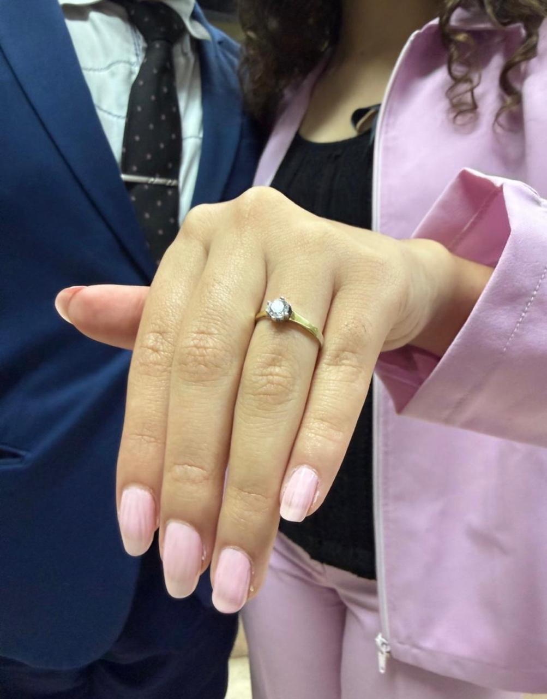
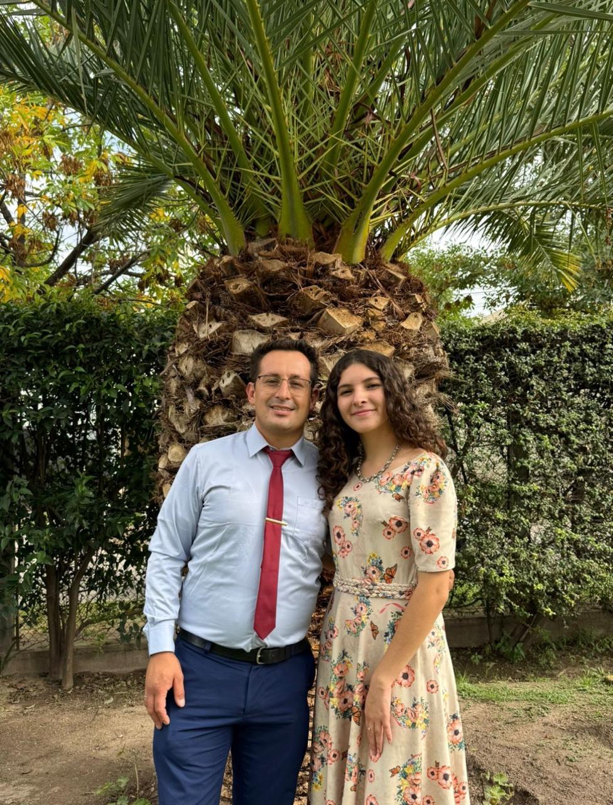

<!DOCTYPE html>
<html lang="es">
<head>
    <meta charset="UTF-8">
    <meta name="viewport" content="width=device-width, initial-scale=1.0">
    <title>Boda - Joan & Alexia</title>

    <link href="https://fonts.googleapis.com/css2?family=Great+Vibes&family=Poppins:wght@300;400;600&display=swap" rel="stylesheet">

    
</head>

<body>

<!-- OVERLAY INICIAL -->

    

        
¡Nos casamos!

        <h1 class="names">Joan & Alexia</h1>
        
10 de Octubre 2026

        
“Dos corazones, un mismo camino”

        <button class="btn-open" onclick="entrar()"> Ver invitación </button>
    

<header>
    <h1 class="fade">Joan & Alexia</h1>
    
10.10.2026

</header>

<section class="fade invitation-text">
    

        Hay momentos en la vida que, por sí solos, ya son especiales.
        Pero cuando se comparten con las personas que más queremos,
        se vuelven verdaderamente inolvidables.
    

    

        Por eso, con mucha alegría,
        queremos invitarte a ser parte de este día tan importante para nosotros:
        <strong>Nuestra boda</strong>.
    

</section>

<section class="fade">
    <h2>Faltan</h2>
    

        
0 Días

        
0 Hs

        
0 Min

        
0 Seg

    

</section>

<section class="bible-verse fade">
    

        "El amor es paciente, es bondadoso. El amor no es envidioso ni jactancioso ni orgulloso.
        No hace nada indebido, no busca lo suyo, no se irrita, no guarda rencor.
        Todo lo disculpa, todo lo cree, todo lo espera, todo lo soporta."
    

    <strong>1 Corintios 13:4-7</strong>
</section>

<section class="fade">
    <h2>Nuestros Momentos</h2>
    

        
        
        
        
    

</section>

    

<audio id="musica" loop>
    <source src="sjjm_S_132.mp3" type="audio/mp3">
</audio>

<button class="music-btn" onclick="toggleMusic()">🎵</button>

</body>
</html>

